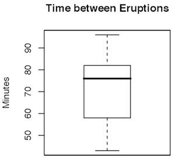
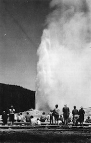
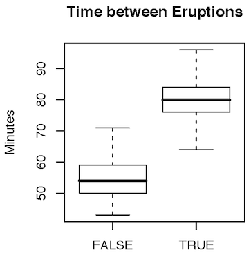

Intro to Statistical Modeling Ch. 3 Prob. 3.17
========================================================
```{r include=FALSE}
require(mosaic)
require(ScoreR)
startProblem("SM-3-P17-SD")
```

As the name suggests, the Old Faithful geyser in Yellowstone National
Park has eruptions that come at fairly predictable intervals, making
it particularly attractive to tourists.






<aside>
The figure is from the National Park Service web site.
www.cr.nps.gov/.../hampton/images/fig3.jpg
</aside>

* You are a busy tourist and have only 10 minutes to sit around and
watch the geyser.  But you can choose when to arrive.  If the last
eruption occurred at noon, what time should you arrive at the geyser
to maximize your chances of seeing an eruption?
```{r include=FALSE}
geyser=selectSet(name="maxchance", totalPts=1, "12:50"=FALSE, "1:00"=FALSE, "1:05"=FALSE, "1:15"=TRUE, "1:25"=FALSE)
```
  `r I(geyser)`

```{r include=FALSE}
geyser2=selectSet(name="probability", totalPts=1, "5%"=FALSE,"10%"=FALSE,"20%"=FALSE, "30%"=TRUE, "50%"=FALSE, "75%"=FALSE)
```
* Roughly, what is the probability that in the best 10-minute interval, you will actually see the eruption: `r I(geyser2)`

```{r include=FALSE}
geyser3=selectSet(name="IQR", totalPts=1, "10 minutes"=FALSE, "15 minutes"=FALSE, "25 minutes"=TRUE, "35 minutes"=FALSE, "50 minutes"=FALSE, "75 minutes"=FALSE)
```
* A simple measure of how faithful is Old Faithful is the interquartile range.  What is the interquartile range, according to the
boxplot above? `r I(geyser3)`

* Not only are you a busy tourist, you are a smart tourist.  Having read about Old Faithful, you understand that the time between eruptions depends on how long the previous eruption lasted.   Here's a box plot indicating the distribution of inter-eruption times when the
previous eruption duration was less than three minutes.  (That is, "TRUE" means the previous eruption lasted less than three minutes.)




You can easily ask the ranger what was the duration of the previous
eruption. 

```{r include=FALSE}
geyser4=selectSet(name="interval", totalPts=1, "1:00 to 1:10"=FALSE, "1:05 to 1:15"=FALSE, "1:10 to 1:20"=FALSE, "1:15 to 1:25"=TRUE, "1:20 to 1:30"=FALSE, "1:25 to 1:35"=FALSE)
```
What is the best 10-minute interval to return (after a noon eruption)
so that you will be most likely to see the next eruption, given that
the previous eruption was less than three minutes in duration (the
"TRUE" category). `r I(geyser4)`

```{r include=FALSE}
geyser5=selectSet(name="likely", totalPts=1, "About 5%"=FALSE, "About 10%"=FALSE, "About 20%"=FALSE, "About 30%"=FALSE, "About 50%"=TRUE, "About 75%")
```
* How likely are you to see an eruption if you return for the most
likely 10-minute interval? `r I(geyser5)`


`r I(endProblem())`

