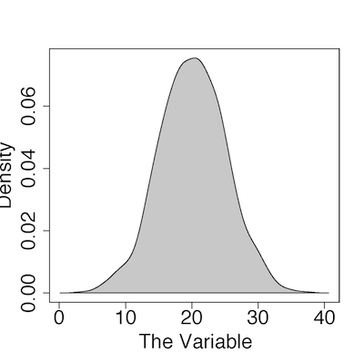
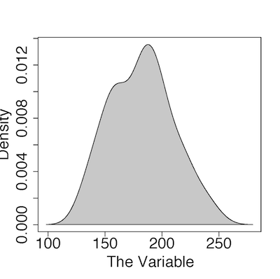

Intro to Statistical Modeling Ch. 3 Prob. 3.18
========================================================
```{r include=FALSE}
require(mosaic)
require(WriteScoreR)
newScorerSet("SM-3-P18-SD")
```

For each of the following distributions, estimate by eye the mean, 
standard deviation, and 95% coverage interval.  Also, calculate the variance.


## Part 1.



```{r include=FALSE}
eyeball=selectNumber(choices=c(10,15,20,25,30), correct=c(20), name="mean", totalPts=1)
```
* Mean: `r I(eyeball)` <aside>enterNumber{20}{4}</aside>

```{r include=FALSE}
eyeball2=selectNumber(choices=c(2,5,12,15,20), correct=c(5), name="StdDev", totalPts=1)
```
* Std. Dev.: `r I(eyeball2)` <aside> %\enterNumber{7}{3} % really 5</aside>

* 95% coverage interval

```{r include=FALSE}
eyeball3=selectNumber(choices=c(1,3,10,15,20), correct=c(10), name="lower", totalPts=1)
```
  * Lower end: `r I(eyeball3)` <aside> %\enterNumber{10}{3}</aside>

```{r include=FALSE}
eyeball4=selectNumber(choices=c(20,25,30,35,40), correct=c(30), name="upper", totalPts=1)
```
  * Upper end: `r I(eyeball4)` <aside>%\enterNumber{30}{3}</aside>

```{r include=FALSE}
eyeball5=selectNumber(choices=c(2,7,10,20,25,70,140,300), correct=c(25), name="variance", totalPts=1)
```

* Variance: `r I(eyeball5)` <aside>% \enterNumber{25}{10}</aside>


## Part 2.




```{r include=FALSE}
part2=selectNumber(choices=c(0.004,150,180,250), correct=c(180), name="mean2", totalPts=1)
```

* Mean: `r I(part2)` <aside>%\enterNumber{180}{20}</aside>

```{r include=FALSE}
part2b=selectNumber(choices=c(10,30,60,80,120), correct=c(30), name="stdev2", totalPts=1)
```

* Std. Dev.:  `r I(part2b)` <aside> %\enterNumber{40}{10} % really 30 </aside>

```{r include=FALSE}
part2c=selectNumber(choices=c(50,80,100,135,150,200,230), correct=c(135), name="lower2", totalPts=1)
```

* 95% coverage interval.

  * Lower end: `r I(part2c)` <aside>% \enterNumber{135}{25}</aside>

```{r include=FALSE}
part2d=selectNumber(choices=c(50,80,100,180,200,230), correct=c(230), name="upper2", totalPts=1)
```

  * Upper end: `r I(part2d)` <aside> %\enterNumber{230}{20}</aside>.

```{r include=FALSE}
part2e=selectNumber(choices=c(30,80,500,900,1600,23000), correct=c(900), name="variance2", totalPts=1)
```

* Variance: `r I(part2e)` <aside> %\enterNumber{1600}{1000} % really 900 </aside>

`r I(closeProblem())`
