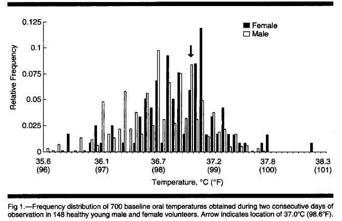

Intro to Statistical Modeling Ch. 3 Prob. 3.50
========================================================
```{r include=FALSE}
require(mosaic)
require(WriteScoreR)
newScorerSet("SM-3-P50-SD")
```

What's a "normal" body temperature?  Depending on whether you
use the Celsius or Fahrenheit scale, you are probably used to the
numbers $37^\circ$ C or $98.6^\circ$ F.  These numbers come from
the work of Carl Wunderlich, published in *Das Verhalten der Eigenwarme
in Krankenheiten* in 1868 based on more than a million measurements
made under the armpit.  According to Wunderlich, "When the organism (man) is in a normal condition,
the general temperature of the body maintains itself at the
physiologic point: $37^\circ$ C $=98.6^\circ$ F."

Since 1868, not only have the techniques for measuring temperatures
improved, but so has the understanding that "normal" is not a single
temperature but a range of temperatures.

A 1992 article in the Journal of the American Medical Association (PA
Mackowiak et al., ``A Critical Appraisal of $98.6^\circ$ F ...''  JAMA
v. 268(12) pp. 1578-1580) examined temperature measurements made
orally with an electronic thermometer.  The subjects were 148 healthy
volunteers between age 18 and 40.

The figure shows the distribution of temperatures, separately for
males and females.  Note that the horizontal scale is given in both C
and F --- this problem will use F.



What's the absolute range for females?
```{r include=FALSE}
temperature=selectNumber(name="min", totalPts=1, choices=c(96.1,96.3,97.1,98.6,99.9,100.8), correct=c(96.3))
```

* Minimum: `r I(temperature)`

```{r include=FALSE}
temperature2=selectNumber(name="max", totalPts=1, choices=c(96.1,96.3,97.1,98.6,99.9,100.8), correct=c(100.8))
```
* Maximum: `r I(temperature2)` 


And for males?

```{r include=FALSE}
temp=selectNumber(choices=c(96.1,96.3,97.1,98.6,99.9,100.8), correct=c(96.1), totalPts=1, name="min1")
```
* Minimum:  `r I(temp)`

```{r include=FALSE}
temp2=selectNumber(choices=c(96.1,96.3,97.1,98.6,99.9,100.8), correct=c(99.9), totalPts=1, name="max1")
```
* Maximum: `r I(temp2)`


Notice that there is an outlier for the females' temperature, as
evidenced by a big gap in temperature between that bar and the next closest bar.  How
big is the gap?
```{r include=FALSE}
f = newMC(totalPts=1)
```

`r I(f(FALSE))` About $0.01^\circ$ F.     
`r I(f(FALSE))` About $0.1^\circ$ F.     
`r I(f(TRUE))` Almost $1^\circ$ F.

```{r include=FALSE, results="hide"}
I(f(finish=TRUE))
```


Give a 95% coverage interval for females.  Hint: The interval will
exclude the most extreme 2.5% of cases on each of the left and right
sides of the distribution.  You can find the left endpoint of the 95%
interval by scanning in from the left, adding up the heights of the
bars until they total 0.025.  Similarly, the right endpoint can be
marked by scanning in from the right until the bars total 0.025.
```{r include=FALSE}
g = newMC(totalPts=1)
```

`r I(g(FALSE))` About $96.2^\circ$ F to about $99.0^\circ$ F     
`r I(g(TRUE))` About $96.8^\circ$ F to about $100.0^\circ$ F     
`r I(g(FALSE))` About $96.8^\circ$ F to about $100.0^\circ$ F     

```{r include=FALSE, results="hide"}
I(g(finish=TRUE))
```

And for males?
```{r include=FALSE}
h = newMC(totalPts=1)
```
`r I(h(FALSE))` About $96.2^\circ$ F to about $99.2^\circ$ F     
`r I(h(TRUE))` About $96.7^\circ$ F to about  $99.4^\circ$ F.     
`r I(h(FALSE))` About $97.5^\circ$ F to about $99.6^\circ$ F

```{r include=FALSE, results="hide"}
I(h(finish=TRUE))
```

`r I(closeProblem())`


