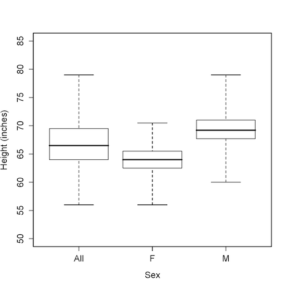

Intro to Statistical Modeling Ch. 3 Reading Questions
========================================================
```{r include=FALSE}
require(mosaic)
require(WriteScoreR)
newScorerSet("SM-03-ReadingQuestions-SD")
```

1. What is the disadvantage of using a 100% coverage interval to
  describe variation? 
```{r include=FALSE, eval=FALSE}
I(textItem(name="disadvantage", totalPts=2, rows=4))
```
  `r I(textItem(name="100perc", totalPts=2, rows=4))`

<aside>
ANSWER:
A 100-percent coverage interval needs to include **all** the
possibilities.  There are situations when this can be useful, but in
general it's more useful to have an interval that includes "typical"
or "likely" possibilities.  The convention in science is to use a
95-percent interval.
</aside>

2. In describing a sample of a variable, 
what is the relationship between the variance and the standard
  deviation?
```{r include=FALSE, eval=FALSE}
I(textItem(name="relat", totalPts=2, rows=4))
```
  `r I(textItem(name="relat", totalPts=2, rows=4))`
  
<aside>
ANSWER:
The standard deviation is just the square root of the variance.  

You might be wondering ... so why use both?  The reason is that the standard deviation has the same
units as the variable in question and quantifies how far a typical
case is from the mean.  But the variance has simpler
mathematical properties.  The situation is much like that encountered
in the Pythagorean theorem that describes the relationship between the
sides of a right triangle.  It's natural to talk about the lengths of
the sides.  But in fact it's the squares of the lengths that have the
simple Pythagorean properties: the square-length of the hypotenuse
equals the sum of square-lengths of the other edges.
</aside>

3. What is a residual?
```{r include=FALSE, eval=FALSE}
I(textItem(name="resid", totalPts=2, rows=4))
```
  `r I(textItem(name="resid", totalPts=2, rows=4))`

<aside>
ANSWER:
The residual is the difference between the model value for a
particular case and the actual value.  Residuals tell how far the
model values are from the actual values.  As you can imagine, in
constructing a model you want to have small residuals --- that the
model should be close to the actual data.
</aside>

4. What's the difference between "density" and "frequency" in
  displaying a variable with a histogram?
```{r include=FALSE, eval=FALSE}
I(textItem(name="dens", totalPts=2, rows=4))
```
  `r I(textItem(name="dens", totalPts=2, rows=4))`

<aside>
ANSWER:
"Frequency" is just a count of how many cases fall into the bin.
That's a simple thing to calculate --- just count!  But it's not so
useful, since it depends on how many cases are in your sample and how
wide the bin is.  If you change these things, the number reported on
the frequency axis will also change. 

In contrast, the "density" tells what fraction of cases fall into
the bin and also takes into account the width of the bin.  The density
scale doesn't change if you had a bigger or smaller sample or if you
changed the bin widths.
</aside>

5. What's a normal distribution?
```{r include=FALSE, eval=FALSE}
I(textItem(name="normal", totalPts=2, rows=4))
```

  `r I(textItem(name="normal", totalPts=2, rows=4))`

<aside>
ANSWER:
The "normal" distribution is a bell-shape pattern: most cases fall
near the typical value.  As you move away from the typical value, the
number of cases falls off steadily in that bell-shaped way.

The word "normal" stems from the fact that the bell-shaped
distribution is encountered in a wide number of settings: it's normal!
But the fact that it's widely encountered doesn't mean it's the only
thing going on.  There are many other kinds of distributions.
</aside>

* Here is the graph showing boxplots of 
height broken down according to sex as well as 
for both males and females together. 




Which components of the boxplot for
"All" match up exactly with the boxplot for "M" or "F"?  Explain
why.
```{r include=FALSE, eval=FALSE}
I(textItem(name="boxplot", totalPts=2, rows=4))
```

  `r I(textItem(name="boxplot", totalPts=2, rows=4))`

<aside>
ANSWER:
Notice that the minimum value of the "All" distribution matches
exactly with the minimum value of "F", and the maximum in "All"
matches with the maximum in "M".  That makes sense, because the
shortest person in the whole group has to be the shortest in either
the M or the F groups --- that shortest person is either an M or an
F.  Similarly for the tallest person.
</aside>

* Variables typically have units.  For example, in Galton's height
data, the height variable has units of inches.  Suppose you are working
with a variable in units of degrees celsius.
What would be the units of the standard deviation of a variable?  Of
the variance? Why are they different?
```{r include=FALSE, eval=FALSE}
I(textItem(name="units", totalPts=2, rows=4))
```
  `r I(textItem(name="units", totalPts=2, rows=4))`

<aside>
ANSWER:
The units of the standard deviation are always the same as the units
of the variable.  So if the variable has units of degrees celsius,
then the standard deviation will be in degrees celsius.

The variance is the square of the standard deviation.  So the units of
variance would be "degrees celsius squared."  That is, admittedly, a
strange sort of unit, which is why most people prefer to talk about
standard deviations rather than variances.  But the variance has other
advantages.
</aside>

`r I(closeProblem())`