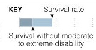
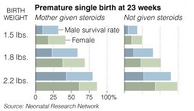

Intro to Statistical Modeling Ch. 6 Prob. 10
========================================================
```{r include=FALSE}
require(mosaic)
require(ScoreR)
startProblem("SM-6-10-SD")
```

The graphic (from the New York *Times*, April 17, 2008) shows the fitted values from a model of the survival of babies born extremely prematurely.

      


> *Caption: "A new study finds that doctors could better estimate an extremely premature baby's chance of survival by considering factors including birth weight, length of gestation, sex and whether the mother was given steroids to help develop the baby's lungs."*


Two different response variables are plotted: (1) the probability of survival 
and (2) the probability of survival without moderate to severe disabilities.
Remarkably for a statistical graphic, there are three explanatory variables:

* Birth weight (measured in pounds (lb) in the graphic).
* Whether the birth was a single baby or involved multiple babies.
* The sex of the baby.
* Whether the mother took steroids intended to help the fetus's lungs develop.  


Focus on the survival rates without disabilities --- the darker bars in
the graphic.


```{r include=FALSE}
babies=selectSet(name="steroids", totalPts=1, "No extra survival probability with steroids."=FALSE, "About 1-5 percentage points"=FALSE, "About 10 to 15 percentage points"=TRUE, "About 50 percentage points"=FALSE, "About 75 percentage points"=FALSE)
```
* Estimate the effect of giving steroids, that is, how much extra
survival probability is associated with giving steroids? `r I(babies)`

```{r include=FALSE}
babies2=selectSet(name="weightdependence", totalPts=1, "No dependence."=FALSE, "Increases by about 25 percentage points."=FALSE, "Increases by about 50 percentage points."=FALSE, "Increases by about 25 percentage points per pound."=FALSE, "Increases by about 50 percentage points per pound."=TRUE)
```
* For the babies where the mother was given steroids, how does the survival probability depend on the birth weight of the baby: `r I(babies2)`

```{r include=FALSE}
babies3=selectSet(name="sexdependence", totalPts=1, "No dependence."=FALSE, "Higher for girls by about 15 percentage points."=TRUE, "Higher for boys by about 20 percentage points."=FALSE, "Higher for girls by about 40 percentage points."=FALSE, "Higher for boys by about 40 percentage points."=FALSE)
```
* For the babies where the mother was given steroids, how does the survival probability depend on the sex of the baby? `r I(babies3)`

```{r include=FALSE}
babies4=selectSet(name="weightAndSex", totalPts=1, "Compare survival of males to females at a given weight."=FALSE, "Compare survival of males across different weights."=FALSE, "Compare survival of females across different weights."=FALSE, "Compare the difference in survival between males and females across
  different weights."=TRUE)
```
* How would you look for an interaction between birth weight and baby's sex in accounting for survival? `r I(babies4)`

```{r include=FALSE}
babies5=selectSet(name="substantialInteraction", totalPts=1, "Yes"=FALSE, "No"=TRUE)
```
Do you see signs of a substantial interaction between birth
  weight and sex in accounting for survival?  (Take substantial to
  mean "greater than 10 percentage points.") `r I(babies5)`

```{r include=FALSE}
babies6=selectSet(name="SteroidUseAndSex", totalPts=1, "Compare survival of males to females when the mother was given steroids."=FALSE, "Compare survival of males between steroid given and steroid not given."=FALSE, "Compare survival of females between steroid given and steroid not given."=FALSE, "Compare the difference in survival between males and females between steroid given and steroid not given."=TRUE)
```
* How would you look for a substantial interaction between steroid use and baby's sex in accounting for survival. `r I(babies6)`

```{r include=FALSE}
babies7=selectSet(name="substantialInteraction2", totalPts=1, "Yes"=FALSE, "No"=TRUE)
```
Do you see signs of a substantial interaction between steroid use and sex in accounting for survival?  (Take substantial to
  mean "greater than 10 percentage points.") `r I(babies7)`

`r I(endProblem())`
