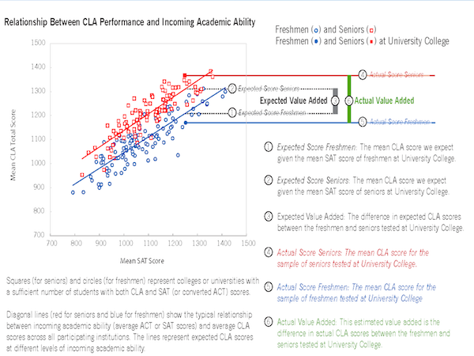

Intro to Statistical Modeling Ch. 6 Prob. 11
========================================================
```{r include=FALSE}
require(mosaic)
require(ScoreR)
startProblem("SM-6-11-SD")
```

The graphic in the Figure is part of a report describing a standardized test for college graduates, the Collegiate Learning Assessment (CLA).  The test consists of several essay questions which probe students' critical thinking skills.  

Although individual students take the test and receive a score, the purpose of the test is not to evaluate the students individually. Instead, the test is intended to evaluate the effect that the institution has on its students as indicated by the difference in test scores between 1st- and 4th-year students (freshmen and seniors). The cases in the graph are institutions, not individual students. 

      
[Council for Aid to Education, "Collegiate Learning Assessment: Draft
Institutional Report, 2005-6" http://www.cae.org]


There are three variables involved in the graphic:
* ***cla*** The CLA test score (averaged over each institution) shown on the vertical axis
* ***sat*** The SAT test score of entering students (averaged over each institution) shown on the horizontal axis
* ***class*** Whether the CLA test was taken by freshmen or seniors. (In the graph: blue for freshmen, red for seniors)


What model is being depicted by the straight lines in the graph?  Give
your answer in the standard modeling notation (e.g, *A* ~ *B* + *C*)
using the variable names above.  Make sure to indicate what
interaction term, if any, has been included in the model and explain
how you can tell whether the interaction is or is not there.

`r I(textItem(name="model", totalPts=2, rows=3))`

<aside>
ANSWER:
The response variable --- on the vertical axis --- is the *CLA score*.
There is obviously a separate line for each group --- red or blue,
referring to seniors or freshmen.  The question is whether the lines
are parallel  or not.  If the lines are not parallel, there must be an
interaction term: *cla* ~ *sat* *\ *class*.  

If the lines are exactly parallel, the model is *cla* ~ *sat* + *class*, without an interaction term. 

Examining the graph closely, it can be seen that the lines are not
exactly parallel.


(Aside: Even a model with an interaction *might* give parallel
lines, if it happened that the interaction term was not playing any
role at all.  But without an interaction term, the lines **must** be parallel.)

</aside>

`r I(endProblem())`