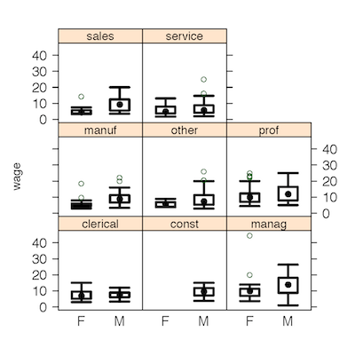

Intro to Statistical Modeling Ch. 6 Prob. 13
========================================================
```{r include=FALSE}
require(mosaic)
require(WriteScoreR)
newScorerSet("SM-6-13-SD")
```

Here is a display constructed using the Current Population Survey wage data:



Which of the following commands will make this? Each of the
possibilities is a working command, so try them out and see which one
makes the matching plot.  Before you start, make sure to read in the
data with 
```{r}
cps = fetchData("CPS85")
```

```{r include=FALSE}
f=newMC(totalPts=1)
```
`r I(f(FALSE))` <code>bwplot( wage ~ sex, groups= sector, data=cps)</code>     
`r I(f(TRUE))` <code> bwplot( wage ~ sex | sector, data=cps)</code>     
`r I(f(FALSE))` <code> bwplot( wage ~ cross(sex,sector), data=cps)</code>
```{r include=FALSE, results="hide"}
I(f(finish=TRUE))
```

`r I(closeProblem())`


