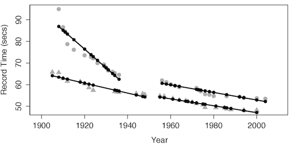

Intro to Statistical Modeling Ch.6 Prob.20
========================================================
```{r include=FALSE}
require(mosaic)
require(WriteScoreR)
newScorerSet("SM-6-20-SD")
```

It's possible to have interaction terms that involve more than two
variables. For instance, one model of the swimming record data
 displayed in Chapter 4 was *time* ~ *year* \* *sex*.
This model design includes an interaction term between year and sex.
This interaction term produces fitted model values that fall on lines
with two different slopes, one for men and one for women.  Now
consider a third possible term to add to the model, the transform term
that is "yes" when the year is larger than 1948 and "no" when the
year is 1948 or earlier.  Call this variable "post-war," since World
War II ended in 1945 and the Olympic games resumed in 1948.  This can
be interpreted to represent the systematic changes that occurred after
the war.


Here is the model of the swimming record data that includes an intercept term, main terms for year, sex, and post-war, and interaction terms among all of those: a three-way interaction.

<aside>
Notes:
from Language/figures.r     
mod6.plot(dots=TRUE, lwd=2.5)     
</aside>




A two-way interaction term between sex and year allows there to be differently sloping lines for men and women.  A three-way interaction term among sex, year, and post-war allows even more flexibility; the difference between slopes for men and women can be different before and after the war.  You can see this from the graph. Before 1948, men's and women's slopes are very different.  After the
war the slopes are almost the same.  

Explain how this graph gives support for the following interpretation:
Before the war, women's participation in competitive sports was rapidly
increasing.  As more women became involved in swimming, records were
rapidly beaten.  After the war, both women and men had high levels of
participation and so new records were the result of better methods of
training.  Those methods apply equally to men and women and so records
are improving at about the same rate for both sexes.

```{r include=FALSE, eval=FALSE}
I(textItem(name="swimming", totalPts=2, rows=4))
```

`r I(closeProblem())`
