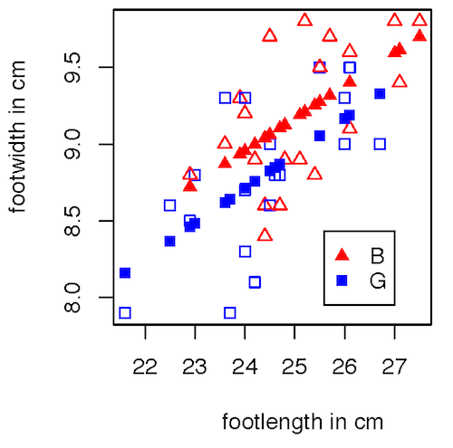

Intro to Statistical Modeling Ch. 7 Prob. 10
========================================================
```{r include=FALSE}
require(mosiac)
require(WriteScoreR)
newScorerSet("SM-7-10-SD")
```

Here is a graph of the kids feet data showing a model of footwidth as
a function of footlength and sex.  Both the *length* and *width* 
variables are measured in cm.  



The model values are solid symbols, the measured data are hollow symbols.

```{r include=FALSE}
feet=selectSet(name="22cm", totalPts=1, "8.0 cm"=FALSE, "8.5 cm"=TRUE, "9.0 cm"=FALSE, "9.5 cm"=FALSE, "Can't tell from this graph."=FALSE)
```
Judging from the graph, what is the model value for a boy with a footlength of 22 cm? `r I(feet)`

```{r include=FALSE}
feet2=selectSet(name="typDif", totalPts=1, "No difference."=FALSE, "0.25 cm"=TRUE, "0.50 cm"=FALSE, "0.75 cm"=FALSE, "1.00 cm"=FALSE, "Can't tell from this graph."=FALSE)
```
According to the model, after adjusting for the difference in foot length, what is the typical difference between the width of a boy's foot and a girl's foot? `r I(feet2)`

```{r include=FALSE}
feet3=selectSet(name="typSize", totalPts=1, "0.10 cm"=FALSE, "0.50 cm"=TRUE, "1.00 cm"=FALSE, "1.50 cm"=FALSE, "Can't tell from this graph."=FALSE)
```
Judging from the graph, what is a typical size of a residual from the
model? `r I(feet3)`

`r I(closeProblem())`


