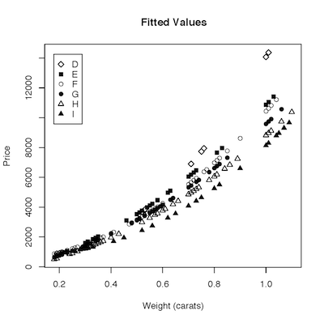

Intro to Statistical Modeling Ch. 7 Prob. 16 
========================================================
```{r include=FALSE}
require(mosaic)
require(WriteScoreR)
newScorerSet("SM-7-16-SD")
```

# Where is this file??

The file `diamonds.csv` contains several variables relating to diamonds: their price, their weight (in carats), their color (which falls into several classes --- D, E, F, G, H, I), and so on.  The following several graphs show different models fitted to the data: price is the response variable and weight and color are the explanatory variables.

<aside>
{comment}
```{r}
diamonds = ISMdata("diamonds.csv")
mod1 = lm( price ~ carat + color, data=diamonds)
mod2 = lm( price ~ carat * color, data=diamonds)
mod3 = lm( price ~ poly(carat,2) + color, data=diamonds)
mod4 = lm( price ~ poly(carat,2) * color, data=diamonds)
plot( mod1$fitted ~ diamonds$carat, pch=c(5,15,1,16,2,17)[as.numeric(diamonds$color)],xlab='Weight (carats)', ylab='Price', main='') 
legend(locator(1), legend=levels(diamonds$color), pch=c(5,15,1,16,2,17))
```
</aside>

Graph 1 | Graph 2
|:-----:|:-----:|
 | 
**Graph 3** | **Graph 4**
 | 


\begin{tabular}{cc}
\includegraphics[width=2in]{../Figures/diamond-linear.png} &
\includegraphics[width=2in]{../Figures/diamond-quad.png} \\
Graph 1 & Graph 2\\\hline\hline
\includegraphics[width=2in]{../Figures/diamond-quad-interaction.png} &
\includegraphics[width=2in]{../Figures/diamond-linear-interaction.png} \\
Graph 3 & Graph 4\\
\end{tabular}


Which model corresponds to which graph?

* *lm( price~carat + color, data=diamonds)*. 

```{r include=FALSE}
diamonds=selectSet(name="corr", totalPts=1, "Graph 1"=TRUE, "Graph 2"=FALSE, "Graph 3"=FALSE, "Graph 4"=FALSE)
```
  Which graph? `r I(diamonds)` 

* *lm( price~carat * color, data=diamonds)*. 

```{r include=FALSE}
diamonds2=selectSet(name="corr2", totalPts=1, "Graph 1"=FALSE, "Graph 2"=FALSE, "Graph 3"=FALSE, "Graph 4"=TRUE)
```
  Which graph? `r I(diamonds2)` 

* *lm( price~poly(carat,2) + color, data=diamonds)*. 

```{r include=FALSE}
diamonds3=selectSet(name="corr3", totalPts=1, "Graph 1"=FALSE, "Graph 2"=TRUE, "Graph 3"=FALSE, "Graph 4"=FALSE )
```
  Which graph? `r I(diamonds3)` 

* *lm( price~poly(carat,2) * color, data=diamonds)*. 

```{r include=FALSE}
diamonds4=selectSet(name="corr4", totalPts=1, "Graph 1"=FALSE, "Graph 2"=FALSE, "Graph 3"=TRUE, "Graph 4"=FALSE)
```
  Which graph? `r I(diamonds4)`

`r I(closeProblem())`

