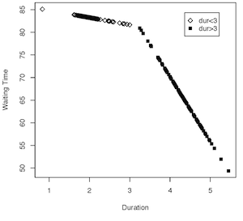
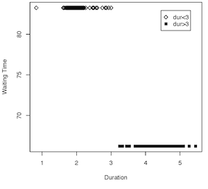
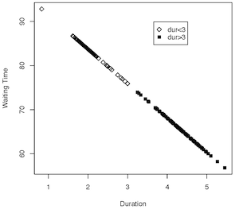
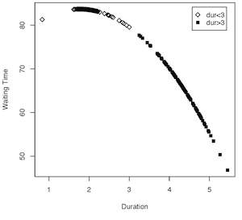
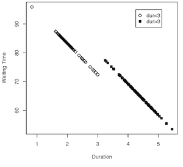

Intro to Statistical Modeling Ch. 7 Prob. 21
========================================================
```{r include=FALSE}
require(mosaic)
require(WriteScoreR)
newScorerSet("SM-7-21-SD")
```

The graphs below show models values for different models of the Old Faithful geyser, located in Yellowstone National Park in the US.  The geyser blows water and steam high in the air in periodic eruptions.  These eruptions are fairly regularly spaced, but there is still variation in the time that elapses from one eruption to the next.

The variables are

* ***waiting*** The time from the previous eruption to the current one
* ***duration*** The duration of the previous eruption
* ***biggerThan3*** A categorical variable constructed from duration, which depicts simply whether the duration was greater or less than 3 minutes.


In each case, judge from the shape of the graph which model is being presented.

A. *waiting* ~ *duration*     
B. *waiting* ~ *duration* + *biggerThan3*    
C. *waiting* ~ *duration* * *biggerThan3*      
D. *waiting* ~ *biggerThan3*      
E. *waiting* ~ poly(*duration*,2)       
F. *waiting* ~ poly(*duration*,2) * *biggerThan3*      

1. | 2.
|:-----:|:-----:|
 | 
**3.** | **4.**
 | 
**5.** | - 
 | -


```{r include=FALSE}
match=selectSet(name="no1", totalPts=1, "A"=FALSE, "B"=FALSE, "C"=TRUE, "D"=FALSE, "E"=FALSE, "F"=FALSE)
```
1. `r I(match)`

```{r include=FALSE}
match2=selectSet(name="no2", totalPts=1, "A"=FALSE, "B"=FALSE, "C"=FALSE, "D"=TRUE, "E"=FALSE, "F"=FALSE)
```
2. `r I(match2)`

```{r include=FALSE}
match3=selectSet(name="no3", totalPts=1, "A"=TRUE, "B"=FALSE, "C"=FALSE, "D"=FALSE, "E"=FALSE, "F"=FALSE)
```
3. `r I(match3)`

```{r include=FALSE}
match4=selectSet(name="no4", totalPts=1, "A"=FALSE, "B"=FALSE, "C"=FALSE, "D"=FALSE, "E"=TRUE, "F"=FALSE)
```
4. `r I(match4)`

```{r include=FALSE}
match5=selectSet(name="no5", totalPts=1, "A"=FALSE, "B"=TRUE, "C"=FALSE, "D"=FALSE, "E"=FALSE, "F"=FALSE)
```
5. `r I(match5)`

<aside>
```{r}
require(MASS)
data(geyser)
biggerThan3 = as.factor( geyser$duration > 3 )
modA = lm( waiting ~ duration, data=geyser)

plot(modA$fitted ~ geyser$duration, pch=c(5,15)[as.numeric(biggerThan3)],xlab='Duration', ylab='Waiting Time')
legend( locator(1), legend=c('dur<3', 'dur>3'), pch=c(5,15))
```

# foo = plot.model(waiting ~ duration*biggerThan3, data=geyser,group.var=biggerThan3, xvar=duration, main='')
# foo = plot.model(waiting ~ duration+biggerThan3, data=geyser,group.var=biggerThan3, xvar=duration, main='')
</aside>

`r I(closeProblem())`