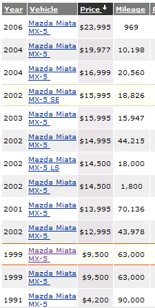

Intro to Statistical Modeling Ch. 7 Prob. 23
========================================================
```{r include=FALSE}
require(mosaic)
require(ScoreR)
startProblem("SM-7-23-SD")
```

Car prices vary.  They vary according to the model of car, the optional features in the car, the geographical location, and the respective bargaining abilities of the buyer and the seller.  

In this project, you are going to investigate the influence of at least three variables on the asking price for used cars:
* Model year
* Mileage
* Geographical location


These variables are relatively easy to measure and code.  There are web sites that allow us quickly to collect a lot of cases.  One site that seems easy to use is [cars](www.cars.com).  Pick a particular model of car that is of interest to you.  Also, pick a few scattered geographical locations.  (At [cars](www.cars.com) you can specify a zip code, and restrict your search to cars within a certain distance of that zip code.)

For each location, use the web site to find prices and the other variables for 50-100 cars.  Record these in a spreadsheet with five variables: price, model year, mileage, location, model name. (The model name will be the same for all your data.  Recording it in the spreadsheet will help in combining data for different types of cars.) You may also choose to record some other variables of interest to you.

Using your data, build models making a series of claims about the patterns seen in used-car prices.  Some basic claims that you should make are in this form:

* Looking just at price versus mileage, the price of car model XXX falls by 12 cents per mile driven.
* Looking just at price versus age, the price of car model XXX falls by 1000 dollars per year of age
  driven.
* Considering both age and mileage, the price of car model XXX falls by ...
* Looking at price versus location, the price differs ...


You may also want to look at interaction terms, for example whether the effect of mileage is modulated by age or location.

Note whether there are outliers in your data and indicate whether these are having a strong influence on the coefficients you find.





Price and other information about used Mazda Miatas in the Saint Paul, Minnesota area from <code>www.cars.com</code>.


`r I(endProblem())`