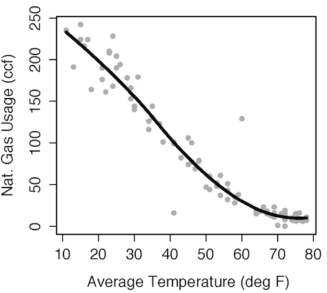

Intro to Statistical Modeling Ch. 8 Prob. 11
========================================================
```{r include=FALSE}
require(mosaic)
require(WriteScoreR)
newScorerSet("SM-8-11-SD")
```
The graph shows some data on natural gas usage (in ccf) versus temperature (in deg. F) along with a model of the relationship.  

     

```{r include=FALSE}
gas=selectSet(name="units", totalPts=1, "ccf"=TRUE, "degF"=FALSE, "ccf.per.degF"=FALSE, "none"=FALSE)
```
* What are the units of the residuals from a model in which natural gas usage is the response variable? `r I(gas)`

```{r include=FALSE}
gas2=selectSet(name="typRes", totalPts=1, "2ccf"=FALSE, "20ccf"=TRUE, "50ccf"=FALSE, "100ccf"=FALSE)
```
* Using the graph, estimate the magnitude of a typical residual, that is, approximately how far a typical case is from the model relationship. (Ignore whether the residual is positive or negative. Just consider how far the case is from the model, whether it be above or below the model curve.) `r I(gas2)`

```{rinclude=FALSE}
gas3=selectSet(name="sizeOfRes", totalPts=1, "2ccf"=FALSE, "20ccf"=FALSE, "50ccf"=FALSE, "100ccf"=TRUE)
```
* There are two cases that are outliers with respect to the model relationship
between the variables.  Approximately how big are the residuals in these two cases? `r I(gas3)`


Now ignore the model and focus just on those two outlier cases and their relationship to the other data points.  

```{r include=FALSE}
gas4=selectSet(name="TF", totalPts=1, "True"=FALSE, "False"=TRUE)
```
* Are the two cases outliers with respect to natural gas usage? `r I(gas4)`

```{r include=FALSE}
gas5=selectSet(name="TF2", totalPts=1, "True"=FALSE, "False"=TRUE)
```
* Are the two cases outliers with respect to temperature? `r I(gas5)`

<aside>
ANSWER:     
Neither of the cases is an extreme value in terms of the natural gas variable or the temperature variable.
</aside>

`r I(closeProblem())`
