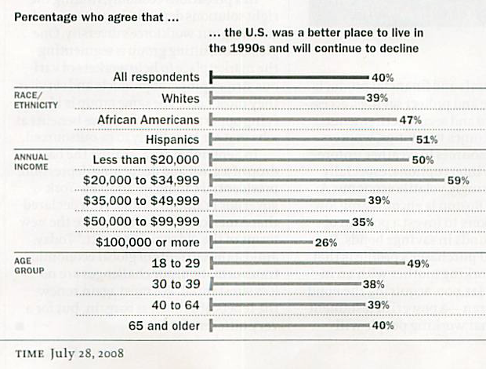

Intro to Statistical Modeling Ch. 10 Prob. 12
========================================================
```{r include=FALSE}
require(mosaic)
require(WriteScoreR)
newScorerSet("SM-10-12-SD")
```

*Time Magazine* reported the results of a poll of people's opinions about the U.S. economy in July 2008.  The results are summarized in the graph.


[Source: *Time*, July 28, 2008, p. 41]

In a typical news media report of a poll, the results are summarized using one explanatory variable at a time.  The point of this exercise is to show that such *univariate* explanations can be misleading.

The poll involves three explanatory variables: *ethnicity*, *income*, and *age*.  Regretably, the reported results treat each of these explanatory variables separately, even though there are likely to be correlations among them. For instance, relatively few people in the 18 to 29 age group have high incomes.

The original data set from which the *Time* graphic was made contains the information needed to study the multiple explanatory variables simultaneously, for example looking at the connection between *pessimism* and *age* while adjusting for *income*. This data set is not available, so you will need to resort to a simulation which attempts to mimic the poll results.  Of course,
the simulation doesn't necessarily describe people's attitudes directly, but it does let you see how the conclusions drawn from the poll might have been different if the results for each explanatory variable had been presented in a
way that adjusts for the other explanatory variables.

The following statement will run a simulation of a poll in which 10,000 people are asked to rate their level of pessimism (on a scale from 0 to 10) and to indicate their age group and income level:

```{r}
poll = run.sim(economic.outlook.poll, 10000)
```
The output of the simulation will be a data frame that looks
something like this:
**SHOULD LOOK LIKE THIS: <code>     
/> head(poll)
             age               income pessimism
1     [18 to 29]   [less than $20000]        10
2     [40 to 64] [$50,000 to $99,999]         5
3     [40 to 64]   [less than $20000]         9
4     [40 to 64] [$50,000 to $99,999]         7
5 [65 and older] [$50,000 to $99,999]         7
6     [18 to 29]   [less than $20000]        10
</code>
Your output will differ because the simulation reflects random
sampling.  


```{r include=FALSE}
time=selectSet(name="model1", totalPts=1, "Middle aged people have lower pessimism than young or old people."=TRUE, "Young people have the least pessimism."=FALSE, "There is no relationship between age and pessimism"=FALSE)
```
* Construct the model *pessimism* ~ *age*-1.  Look at the coefficients and choose the statement that best reflects the results: `r I(time)`

```{r include=FALSE}
time2=selectSet(name="model2", totalPts=1, "Higher income people are more pessimistic than low-income people."=FALSE, "Higher income people are less pessimistic than low-income people."=TRUE, "There is no relationship between income and pessimism"=FALSE)
```
* Now construct the model *pessimism* ~ *income* - 1.  Look at the coefficients and choose the statement that best reflects the results: `r I(time2)`

```{r include=FALSE, eval=FALSE}
I(textItem(name="ModelFormula", totalPts=1, rows=3))
```
* Construct a model in which you can look at the relationship between *pessimism* and *age* while *adjusting for* *income*.  That is, include *income* as a covariate in your model. Enter your model formula here: `r I(textItem(name="ModelFormula", totalPts=1, rows=3))`

```{r include=FALSE}
time3=selectSet(name="model3", totalPts=1, "Holding income constant, older people tend to have higher levels of pessimism than young people"=TRUE, "Holding income constant, young people tend to have higher levels of pessimism than old people"=FALSE, "Holding income constant, there is no relationship between age and pessimism."=FALSE)
```
Look at the coefficients from your model and choose the statement that best reflects the results: `r I(time3)`

```{r include=FALSE}
time4=selectSet(name="model4", totalPts=1, "Holding age constant, higher income people are more pessimistic than low-income people."=FALSE, "Holding age constant, higher income people are less pessimistic than low-income people."=TRUE, "Holding age constant, there is no relationship between income and pessimism."=FALSE)
```
* You can also interpret that same model to see the relationship between *pessimism* and *income* while *adjusting for* *age*. Which of the following statements best reflects the results?  (Hint: make sure to pay attention to the sign of the coefficients.) `r I(time4)`


`r I(closeProblem())`
