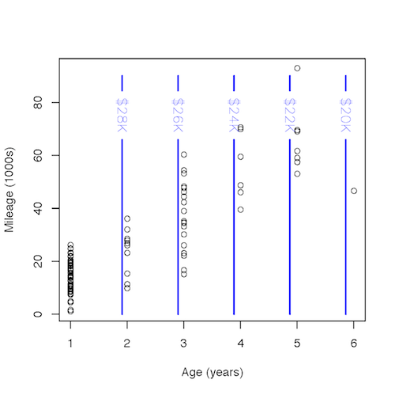

Intro to Statistical Modeling Ch. 10 Prob. 20
========================================================
```{r include=FALSE}
require(mosaic)
require(WriteScoreR)
newScorerSet("SM-10-20-SD")
```

Whenever you seek to study a partial relationship, there must be at least three variables involves: a response variable, an explanatory variable that is of direct interest, and one or more other explanatory variables that will be held constant: the co-variates.  Unfortunately, it's hard to graph out models involving three variables on paper: the usual graph of a model just shows one variable as a function of a second.

One way to display the relationship between a response variable and two quantitative explanatory variables is to use a contour plot.  The two explanatory variables are plotted on the axes and the fitted model values are shown by the contours.  The figure shows such a display of the fitted model of used car prices as a function of *mileage* and *age*.


The dots are the *mileage* and *age* of the individual cars --- the model *Price* is indicated by the contours.  

The total relationship between *Price* and *mileage* involves how the price changes for typical cars of different mileage.  Pick a dot that is a typical car with about 10,000 miles.  Using the contours, find the model price of this car.

```{r include=FALSE}
car=selectNumber(choices=c(18000,21000,25000,30000), correct=c(30000), totalPts=1, name="modelPrice")
```
Which of the following is closest to the model price (in dollars)? `r I(car)`

```{r include=FALSE}
car2=selectNumber(choices=c(18000,21000,25000,30000), correct=c(21000), totalPts=1, name="70000miles")
```
Now pick another dot that is a typical car with about 70,000 miles. Using the contours, find the model price of this car. `r I(car2)`

```{r include=FALSE}
f=newMC(totalPts=1)
```
The total relationship between *Price* and *mileage* is reflected by this
ratio: change in model price divided by change in mileage. What is that ratio (roughly)?     
`r I(f(TRUE))` $\frac{30000 - 21000}{70000-10000}=0.15$ dollars/mile     
`r I(f(FALSE))` $\frac{70000-10000}{25000-21000}=15.0$ dollars/mile     
`r I(f(FALSE))` $\frac{25000 - 18000}{70000-10000}=0.12$ dollars/mile     
```{r include=FALSE, results="hide"}
I(f(finish=TRUE))
```

In contrast, the partial relationship between *Price* and *mileage* holding
*age* constant is found in a different way, by comparing two points with different mileage but exactly the same age.

```{r include=FALSE}
car3=selectNumber(choices=c(22000,24000,26000,28000,30000), correct=c(28000), totalPts=1, name="10000miles")
```
Mark a point on the graph where age is 3 years and mileage is 10000. Keep in mind that this point doesn't need to be an actual car, that is, a data point in the graph typical car.  There might be no actual car with an age of 3 years and mileage 10000. But using the contour model, find the model price at this point: `r I(car3)`

```{r include=FALSE}
car4=selectNumber(choices=c(22000,24000,26000,28000,30000), correct=c(22000), totalPts=1, name="80000miles")
```
Now find another point, one where the age is exactly the same (3 years) but the mileage is different.  Again there might not be an actual car there.  Let's pick mileage as 80000. Using the contours, find the model price at this point: `r I(22000)`

```{r include=FALSE}
g=newMC(totalPts=1)
```
The partial relationship between price and mileage (holding age constant) is reflected again reflected by the ratio of the change in model price divided by the change in mileage. What is that ratio (roughly)?     
`r I(g(FALSE))` $\frac{80000-10000}{25000-21000} = 17.50$ dollars/mile     
`r I(g(TRUE))` $\frac{28000 - 22000}{80000-10000}=0.09$ dollars/mile     
`r I(g(FALSE))` $\frac{26000 - 24000}{80000-10000}=0.03$ dollars/mile
```{r include=FALSE, results="hide"}
I(g(finish=FALSE))
```

Both the total relationship and the partial relationship are indicated by the slope of the model price function given by the contours.  The total relationship involves the slope between two points that are typical cars, as indicated by the dots.  The partial relationship involves a slope along a different direction.  When holding age constant, that direction is the one where mileage changes but age does not (vertical in the graph).  

There's also a partial relationship between price and age holding mileage constant.  That partial relationship involves the slope along the direction where age changes but mileage is held constant.  Estimate that slope by finding the model price at a point where age is 2 years and another point where age is 5 years.  You can pick whatever mileage you like, but it's key that your two points be at exactly the same mileage.

```{r include=FALSE}
car5=selectSet(name="slope", totalPts=1, "100 dollars per year"=FALSE, "500 dollars per year"=FALSE, "1000 dollars per year"=TRUE, "2000 dollars per year"=FALSE)
```
Estimate the slope of the price function along a direction where age changes but mileage is held constant (horizontally on the graph). `r I(car5)`

The contour plot above shows a model in which both mileage and age are explanatory variables.  By choosing the direction in which to measure the slope, one determines whether the slope reflects a total relationship (a direction between typical cars), or a partial relationship holding age constant (a direction where age does not change, which might not be typical for cars), or a partial relationship holding mileage constant (a direction where mileage does
not change, which also might not be typical for cars). 

In calculus, the partial derivative of price with respect to mileage refers to an infinitesimal change in a direction where age is held constant.  Similarly, the partial derivative of price with respect to age refers to an infinitesimal change in a direction where mileage is held constant.

Of course, in order for the directional derivatives to make sense, the price function needs to have **both** age and mileage as explanatory variables.  The following contour plot shows a model in which only *age* has been used as an explanatory variable: there is no dependence of the function on *mileage*.




Such a model is incapable of distinguishing between a partial relationship and a total relationship.  Both the partial and the total relationship involve a ratio of the change in price and change in age between two points.  For the total relationship, those two points would be typical cars of different ages.  For the partial relationship, those two points would be different ages at exactly the
same mileage.  But, because the model depend on mileage, the two ratios will be exactly the same.

`r I(closeProblem())`