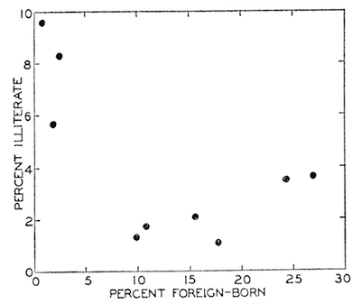
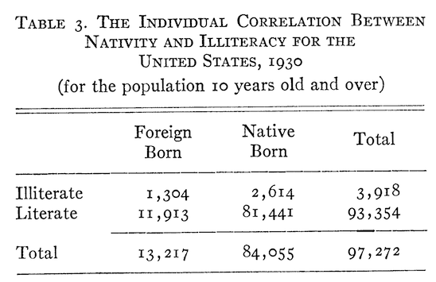

Intro to Statistical Modeling Ch. 10 Prob. 21
========================================================
```{r include=FALSE}
require(mosaic)
require(WriteScoreR)
newScorerSet("SM-10-21-SD")
```

Sometimes people use data in aggregated form to draw conclusions about individuals.  For example, in 1950 W.S. Robinson described the correlation between immigration and illiteracy done in two different ways.[<code>robinson-1950</code>]  In the first, the unit of analysis is individual US states as shown in the figure --- the plot shows the fraction of people in each state who are illiterate versus the fraction of people who are foreign born.  The correlation is negative, meaning that states with higher foreign-born populations have *em
less* illiteracy.



Robinson's second analysis involves the same data, but takes the unit of analysis as an individual person.  The table gives the number of people who are illiterate and who are foreign born in the states included in the scatter plot.



The data in the table leads to a different conclusion than the analysis of states: the foreign born people are *more* likely to be illiterate.

This conflict between the results of the analyses, analogous to Simpson's paradox, is called the **ecological fallacy**.  (The word "ecological" is rooted in the Greek word *oikos* for house --- think of the choice between studying individuals or the groups of individuals in their houses.)

The ecological fallacy is not a paradox; it isn't a question of what is the correct unit of analysis.  If you want to study the characteristic of individuals, your unit of analysis should be individuals.  If you want to study groups, your unit of analysis should be those groups.  It's a fallacy to study groups when your interest is in individuals.

One way to think about the difference between Robinson's conclusions with groups (the states) and the very different conclusions with individuals, is the factors that create the groups.  Give an explanation, in everyday terms, why the immigrants that Robinson studied might tend to be clustered in states with low illiteracy rates, even if the immigrants themselves had high rates of
illiteracy. 
```{r include=FALSE, eval=FALSE}
I(textItem(name="explanation", totalPts=2, rows=3))
```

`r I(textItem(name="explanation", totalPts=2, rows=3))`

`r I(closeProblem())`

