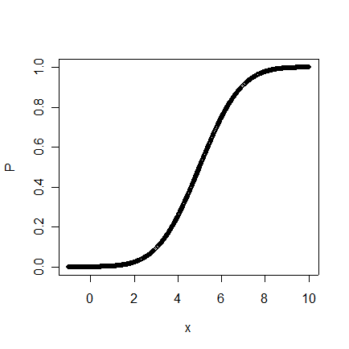

Intro to Statistical Modeling Ch. 11 Prob. 20
========================================================
```{r include=FALSE}
require(mosaic)
require(ScoreR)
startProblem("SM-11-20-SD")
```

The graph shows a cumulative probability.

     

```{r include=FALSE}
graph=selectNumber(choices=c(0,2,4,6,8), correct=c(4), totalPts=1, name="estimate")
```
* Use the graph to estimate by eye the 20th percentile of the probability distribution. (Select the closest answer.) `r I(graph)`

```{r include=FALSE}
graph2=selectNumber(choices=c(0.05,0.25,0.50,0.75,0.95), correct=c(0.50), totalPts=1, name="estimate2")
```
* Using the graph, estimate by eye the probability of a randomly selected x falling between 5 and 8?  (Select the closest answer.) `r I(graph2)`

`r I(endProblem())`