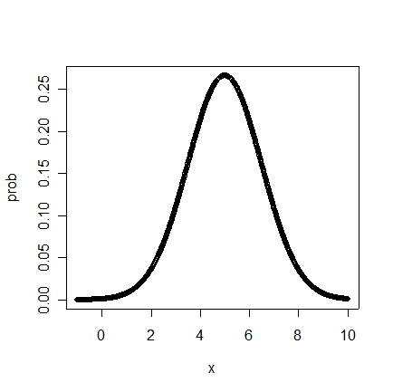

Intro to Statistical Modeling Ch. 11 Prob. 31
========================================================
```{r include=FALSE}
require(mosaic)
require(WriteScoreR)
newScorerSet("SM-11-31-SD")
```

Here is a graph of a probability density.




```{r include=FALSE}
graph=selectNumber(choices=c(0.05,0.25,0.50,0.75,0.95), correct=c(0.05), totalPts=1, name="estimate")
```
* Using the graph, estimate by eye the probability of a randomly selected x falling between 2 and 4. (Give the closest answer.) `r I(graph)`

```{r include=FALSE}
graph2=selectNumber(choices=c(0.05,0.25,0.50,0.75,0.95), correct=c(0.05), totalPts=1, name="estimate2")
```
* Using the graph of probability density above, estimate by eye the probability of a randomly selected x being less than 2. (Give the closest answer.) `r I(graph2)`

`r I(closeProblem())`
