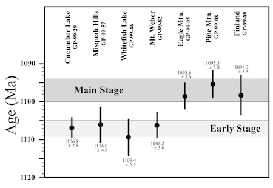

Intro to Statistical Modeling Ch. 11 Prob. 47
========================================================
```{r include=FALSE}
require(mosaic)
require(ScoreR)
startProblem("SM-11-47-SD")
```
Geology Professor Karl Wirth studies the age of rocks as determined by ratios of isotropes.  The figure shows the results of an age assay of rocks collected at seven sites.  Because of the intrinsically random nature of radioactive decay, the measured age is a random variable and has been reported as a mean (in millions of years before the present) and a standard deviation (in the same units).



From the geology of the sites, four of them have been classified as "early stage" and three as "main stage."  The graph clearly indicates that the early stage rocks tend to be younger than the main stage rocks.  But perhaps this
is just the luck of the draw.

Professor Wirth wants to calculate a new random variable: the difference in mean ages between the early and main stage rocks.  Since the age difference is a random variable, Prof. Wirth needs to know both the variable's mean and it's standard deviation.

To get you started on the calculation, here's the formula for the difference in mean ages, $\Delta_{\mbox{age}}$ of the rocks from the two different stages.

$$ \Delta_{\mbox{age}} = \frac{1}{3}(M_1 + M_2 + M_3) + \frac{1}{4}
(E_1 + E_2 + E_3 + E_4) $$
where $M_i$ is a rock from the main stage and $E_i$ is a rock from the early stage.

To remind you, here are the arithmetic rules for the means and variances of random variables $V$ and $W$ when summed and multiplied by fixed constants $a$ and $b$: 
* mean( $a V$ ) = $a$ mean( $V$ )
* var( $a V$ ) = $a^2$ var( $V$ )
* mean( $a V + b W$ ) = $a$ mean( $V$ ) + $b$ mean( $W$ )
* var( $a V + b W$ ) = $a^2$ var( $V$ ) + $b^2$ var( $W$ )


Do calculations based on the above formulas to answer these questions:

* What is the mean of $\Delta_{\mbox{age}}$?  What are the units?    
  `r I(textItem(name="meanAndUnits", totalPts=2, rows=2))`

* What is the variance of $\Delta_{\mbox{age}}$?  What are the units?    
  `r I(textItem(name="variance", totalPts=2, rows=2))`

* What is the variance of $\Delta_{\mbox{age}}$? What are the units?    
  `r I(textItem(name="variance2", totalPts=2, rows=2))`

* A skeptic claims that the two stages do not differ in age.  He points out, correctly, that since $\Delta_{\mbox{age}}$ is a random variable, there is some possibility that its value is zero?  What is the z-score of the value 0 in the distribution of $\Delta_{\mbox{age}}$?    
  `r I(textItem(name="z-score", totalPts=2, rows=2))`

`r I(endProblem())` 