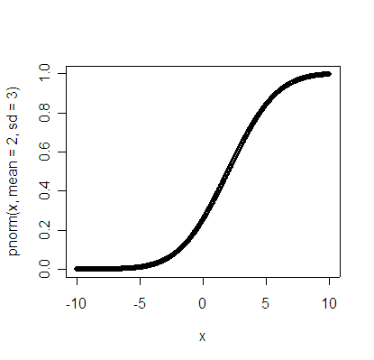
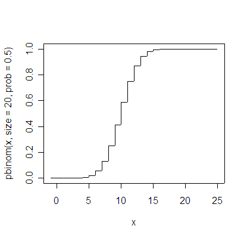

Intro to Statistical Modeling Ch. 11 Prob. 48
========================================================
```{r include=FALSE}
require(mosaic)
require(ScoreR)
startProblem("SM-11-48-SD")
```

Below are two different graphs of cumulative probability distributions. Using the appropriate graph, not the computer, estimate the items listed below.  Your estimates are not expected to be perfect, but do mark on the graph to show the reasoning behind your answer:

* The 75th percentile of a normal distribution with mean 2 and standard deviation 3.

* When flipping 20 fair coins, the probability of getting 7 or fewer heads.

* The probability of x being 1 standard deviation or more below the mean of a normal distribution.

* The range that covers 90% of the most likely number of heads when flipping 20 fair coins.

<aside>
NOTE:     
This is harder, so do it only when you have done all the other problems on this exam: The mean and standard deviation of the number of heads when flipping 20 fair coins.  (Estimate this graphically, using information available from the graphed normal distribution.)
</aside>






`r I(endProblem())`