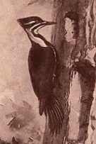
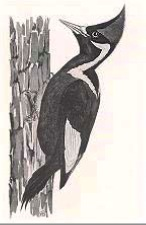

Intro to Statistical Modeling Ch. 13 Prob. 15
========================================================
```{r include=FALSE}
require(mosaic)
require(ScoreR)
startProblem("SM-13-15-SD")
```

The Ivory-billed woodpecker has been thought to be extinct; the last known observation of one was in 1944.  A new sighting in the Pearl River forest in Arkansas in 2004 became national news and excited efforts to confirm the sighting. These have not been successful and there is skepticism whether the
reported 2004 sighting was correct.  This is not an easy matter since the 2004 sighting was fleeting and the Ivory-billed woodpecker is very similar to a relatively common bird, the Pileated woodpecker.

 | 
|:----:|:----:|

Pileated (left) and Ivory-billed Woodpeckers     
Drawings by Ernest S Thompson & Rex Brasher


This problem is motivated by the controversy over the Ivory-billed sighting, but the problem is a gross simplification.

Ivory-billed woodpeckers are 19 to 21 inches long, while Pileated woodpeckers are 16 to 19 inches.  Ivory-bills are generally glossy blue-black, whereas Pileated woodpeckers are generally dull black, slaty or brownish-black.  Ivory-bills have white wing tops while Pileated woodpeckers have white underwings.  These differences would make it easy to distinguish between the two types of birds, but sightings are often at a distance in difficult lighting conditions.  It can be difficult, particularly in the woods, to know whether a distant bird
is flying toward the observer or away.  

Imagine a study where researchers display bird models in realistic observing conditions and record what the observers saw.  The result of this study can usefully be stated as conditional probabilities:

| | | Alternative | Null
|:---:|:---:|:---:|:---:|
Oberved | Code | Ivory-billed | Pileated
Short & Dull | A | 0.01 | 0.60
Long & Dull | B | 0.10 | 0.13
Short & Glossy | C | 0.04 | 0.20
Long & Glossy | D | 0.60 | 0.05
Short & White Back | E | 0.05 | 0.01
Long & White Back | F | 0.20 | 0.01

For simplicity, each of the six possible observations has been given a code: A, B, C, and so on.


#### The Bayesian Approach

The table above gives conditional probabilities of this form: *given that the bird is an Ivory-billed woodpecker*, the probability of observation D is 0.60.  

In the Bayesian approach, you use the information in the table to compute a different form of conditional probability, in this form: *given that you observed D*, what is the probability of the bird being an Ivory-billed.

In order to switch the form of the conditional probability from "given that the bird is ..." to "given that the observation is...", you need some additional information, called the *prior probability*.  The prior probability reflects your view of how likely a random bird is to be an Ivory-billed or Pileated **before** you make any observation.  Then, working through the Bayesian calculations, you will find the **posterior probability**, that is, the probability **after** you make your observation.

Suppose that, based on your prior knowledge of the history and biology of the Ivory-bill, that your prior probability that the sighting was really an Ivory-bill is 0.01, and the probability that the sighting was a Pileated is 0.99.  With this information, you can calculate the **joint** probability of any of the 12 outcomes in the table.  

Then, by considering each row of the table, you can calculate the **marginal** probability of Ivory-bill vs Pileated for each of the possible observations.

```{r include=FALSE}
bird=selectSet(name="DandIvory", totalPts=1, "impossible"=FALSE, "0.006"=TRUE, "0.01"=FALSE, "0.05"=FALSE, "0.60"=FALSE)
```
* What is the joint probability of a sighting being both D and Ivory-billed? (Pick the closest one.) `r I(bird)`

```{r include=FALSE}
bird2=selectSet(name="DandPileated", totalPts=1, "impossible"=FALSE, "0.006"=FALSE, "0.05"=TRUE, "0.60"=FALSE)
```
* What is the joint probability of a sighting being both D and Pileated?
(Pick the closest one.) `r I(bird2)`

```{r include=FALSE}
bird3=selectNumber(name="IvoryAndDconditional", totalPts=1, choices=c(0.01,0.05,0.10,0.60), correct=c(0.10))
```
* What is the conditional probability of the sighting being an Ivory-billed GIVEN that it was D? (Pick the closest one.) `r I(bird3)`

```{r include=FALSE}
bird4=selectSet(name="IvoryBillPosterior", totalPts=1, "A"=FALSE, "B"=FALSE, "C"=FALSE, "D"=FALSE, "E"=FALSE, "F"=TRUE)
```
* Which of the possible observations would provide the largest posterior  probability that the observation was of an Ivory-bill? `r I(bird4)`

```{r include=FALSE}
bird5=selectNumber(choices=c(0.02,0.08,0.17,0.73), correct=c(0.17), totalPts=1, name="largestPostProb")
```
* What is that largest posterior probability? (Pick the closest one.) `r I(bird5)`


#### The Hypothesis-Testing Approach

The hypothesis-testing approach is fundamentally different from the Bayesian approach.  In hypothesis testing, you pick a null hypothesis that you are interested in disproving. Since the Pileated woodpecker is relatively common, it seems sensible to say that the null hypothesis is that the observation is a Pileated woodpecker, and treat the Ivory-billed as the alternative hypothesis.

Once you have the null hypothesis, you choose rejection criteria based on observations that are unlikely given the null hypothesis.  You can read these off directly from the conditional probability table given above.


```{r include=FALSE}
bird6=selectNumber(choices=c(0.01,0.02,0.05,0.25,0.60,0.65), correct=c(0.02), totalPts=1, name="significance")
```
* The two least likely observations are E and F.  If observing E or F is the criterion for rejecting the null hypothesis, what is the significance of the test? `r I(bird6)`

```{r include=FALSE}
bird7=selectNumber(choices=c(0.01,0.05,0.25,0.60,0.65), correct=c(0.25), totalPts=1, name="power")
```
* What would be the power of this test? `r I(bird7)`

Now suppose the rejection criteria are broadened to include D, E, and F. 

```{r include=FALSE}
bird8=selectSet(name="significance2", totalPts=1,"0.01"=FALSE,"0.02"=FALSE,"0.05"=FALSE,"0.07"=TRUE,"0.10"=FALSE,"0.20"=FALSE,"0.25"=FALSE,"0.60"=FALSE,"0.85"=FALSE,"other"=FALSE)
```
* What would be the significance of such a test? `r I(bird8)`

```{r include=FALSE}
bird9=selectSet(name="power2", totalPts=1, "0.01"=FALSE,"0.02"=FALSE,"0.05"=FALSE,"0.07"=FALSE,"0.10"=FALSE,"0.20"=FALSE,"0.25"=FALSE,"0.60"=FALSE,"0.85"=TRUE,"other"=FALSE)
```
* What would be the power of such a test? `r I(bird9)`


```{r include=FALSE, eval=FALSE}
I(textItem(name="why", totalPts=2, rows=3))
```
Comparing the Bayesian and hypothesis-testing approaches, explain why you might reject the null hypothesis even if the observation was very likely to be a Pileated woodpecker.

`r I(textItem(name="why", totalPts=2, rows=3))`

`r I(endProblem())`
