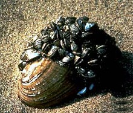

Intro to Statistical Modeling Ch. 14 Prob. 12
========================================================
```{r include=FALSE}
require(mosaic)
require(WriteScoreR)
newScorerSet("SM-14-12-SD")
```

Zebra mussels are a small, fast reproducing species of freshwater mussel native to the lakes of southeast Russia.  They have accidentally been introduced in other areas, competing with native species and creating problems for people as they cover the undersides of docks and boats, clog water intakes and other underwater structures.  Zebra mussels even attach themselves to other mussels, sometimes starving those mussels.

    
***Zebra mussels growing on a larger, native mussel.***    

Ecologists Shirley Baker and Daniel Hornbach examined whether zebra mussels gain an advantage by attaching to other mussels rather than to rocks.(*baker-hornbach-2008*) The ecologists collected samples of small rocks and *Amblema plicata* mussels, each of which had a collection of zebra mussels attached.  The samples were transported to a laboratory where the group of mussels from each individual rock or *Amblema* were removed and placed in an aquarium equipped to measure oxygen uptake and ammonia excretion.  After these physiological measurements were made,  the biochemical composition of the mussel tissue was determined: the percentage of protein, lipid, carbohydrate, and ash.  

Baker and Hornbach found that zebra mussels attached to *Amblema* had greater physiological activity than those attached to rocks as measured by oxygen uptake and ammonia excretion.  But this appears to be a sign of extra effort for the *Amblema*-attached zebra mussels, since they had lower carbohydrate and lipid levels.  In other words, attaching to *Amblema* appears to be disadvantageous to the zebra mussels compared to attaching to a rock.

In this problem, you will use the data collected by Baker and Hornbach to reprise their statistical analysis.  The data are in the file <code>zebra-mussels.csv</code>. 

| | GroupID | dry.mass | count | attachment | ammonia | O2 | 
|:---|----:|---:|---:|---:|---:|---:|
| 1 | 1 | 0.55 | 20 | Rock | 0.075 | 0.082 |
| 2 | 2 | 0.45 | 19 | Rock | 0.066 | 0.70 |
| 3 | 3 | 0.37 | 20 | Rock | 0.074 | 0.062 |
| | ... | and | so | on | ... | | |
| 28 | 28 | 0.89 | 28 | Amblema | 0.248 | 2.68 |
| 29 | 29 | 0.70 | 31 | Amblema | 0.258 | 2.26 |
| 30 | 30 | 0.68 | 64 | Amblema | 0.235 | 2.05 |


</aside>
NOTE:     
 
| GroupID | dry.mass | count | attachment | lipid | protein | carbo | ash | Kcal | ammonia  | O2|
|:---|---:|---:|---:|---:|---:|---:|---:|---:|---:|---:|---:|
| 1 | 1 | 0.55 | 20 | Rock | 8.1 | 47 | 22 | 5.5 | 3.6 | 0.075 | 0.82 |
| 2 | 2 | 0.45 | 19 | Rock | 9.3 | 54 | 23 | 6.3 | 4.1 | 0.066 | 0.70 |
| 3 | 3 | 0.37 | 20 | Rock | 9.1 | 49 | 21 | 5.6 | 3.7 | 0.074 | 0.62 |
| | ... | and | so| on | ... | | |
| 28 | 28 | 0.89 | 28 | Amblema | 8.2 | 60 | NA | 5.5 | NA | 0.248 | 2.68 |
| 29 | 29 | 0.70 | 31 | Amblema | 9.4 | 49 | 21 | 5.8 | 3.8 | 0.258 | 2.26 |
| 30 | 30 | 0.68 | 64 | Amblema | 8.0 | NA | 18 | NA | NA | 0.235 | 2.05 |
</aside>

There are 30 cases altogether. The unit of analysis was not an individual zebra mussel but the group of zebra mussels that were attached to individual rocks or *Amblema*.  


The variables are:
* *dry.mass* The mass of the dried tissue of the group, in grams.

* *count*  How many mussels in the group.

* *attachment* The substrate to which the mussels in the group were attached: a rock or an *Amblema* mussel.

* *O2*  Oxygen uptake in mg per hour for the group.

* *ammonia* -- Nitrogen excretion measured as ammonia in mg per hour for the group.

* *lipid*, *protein*, *carbo*, *ash* Biochemical makeup as percent of the dry weight for each of these.

* *Kcal* Total calorific value of the tissue in kilo-calories per gram.


A first question is whether the amount of mussel tissue is greater for the rock-attached or the *Amblema*-attached zebra mussels.  Here is the report of a model:
```{r}
z = fetchData("zebra-mussels.csv")
summary(lm(dry.mass ~ attachment, data=z))
```


```{r include=FALSE}
prob1=selectSet(name="dataSupport", totalPts=1, "Smaller mass for rock-attached mussels, as a group."=TRUE, "Larger mass for rock attached mussels, as a group."=FALSE, "No statistically significant difference in mass between the rock-and Amblema-attached mussels."=FALSE)
```
Based on this report, which of these claims do data support? `r I(prob1)`

<aside>
ANSWER:    
Note that the coefficient on *attachmentRock* is negative, suggesting that the *dry.mass* of mussels attached to a rock is smaller than the reference group (those attached to other mussels. The corresponding p-value is small ($0.016$), suggesting that it's unlikely that a negative coefficient of this size would be the result of sampling variation.
</aside>


The *dry.mass* variable gives the mass of the entire group of mussels.  It might be that the mussels were systematically different in size on the two different substrates.  One way to look at this is to compute the dry mass per individual mussel. This can be calculated by dividing *dry.mass* by *count*:
```{r eval=FALSE}
z$ind.mass = z$dry.mass / z$count
```

```{r include=FALSE}
prob2=selectSet(name="claimSupport2", totalPts=1, "Smaller mass for rock-attached mussels, as a group."=FALSE, "Larger mass for rock-attached mussels, as a group."=FALSE, "No statistically significant difference in mass between the rock- and Amblema-attached mussels."=TRUE)
```
Fit a model of *ind.mass* versus *attachment*.  Which of the claims does this model support? `r I(prob2)`

<aside>
ANSWER:    
```{r}
z$ind.mass = z$dry.mass / z$count
summary(lm( ind.mass ~ attachment, data=z))
```
 

At first glance, the coefficient on *attachmentRock* seems positive, suggesting that the mass of individual mussels is greater for those attached to a rock than for the reference group.  However, the large p-value (0.53) suggests that a coefficient of this size could easily be the result of sampling variation in a population in which there is no relationship between the form of attachment and the individual mass.
</aside>


In summarizing their results about oxygen uptake and nitrogen excretion, Baker and Hornbach wrote:
> *Attachment substrate had significant effects on ammonia excretion and oxygen uptake rates. Dreissenids [that is, Zebra mussels] attached to Amblema had higher ammonia excretion rates ($p < 0.0001$) and higher oxygen uptake rates ($p < 0.0001$) compared to dreissenids attached to rocks.

To check their statistics, fit these models for oxygen uptake per individual and ammonia excretion per individual:

```{r}
mod1 = lm( O2/count ~ attachment, data=z )
mod2 = lm( ammonia/count ~ attachment, data=z )
```

The coefficients on the *attachment* variable indicate that:
```{r include=FALSE}
prob3=selectSet(name="ammoniaExcretion", totalPts=1, "lower"=TRUE, "higher"=FALSE)
```
* ammonia excretion is `r I(prob3)` for rock-attached zebra mussels than for *Amblema*-attached mussels.

<aside>
ANSWER:    
Model 2 is the one that examines ammonia excretion:
```{r}
summary(mod2)
```

The coefficient on *attachmentRock* is negative, suggesting that ammonia excretion is lower for rock-attached mussels.  The p-value is $0.037$, just barely below the standard for declaring the result "statistically significant."
</aside>
```{r include=FALSE}
prob4=selectSet(name="oxygenUptake", totalPts=1, "lower"=TRUE, "higher"=FALSE)
```
* oxygen uptake is `r I(prob4)` for rock-attached than for *Amblema-attached*.

<aside>
Model 1 is the one that examines oxygen uptake:
```{r}
summary(mod1)
```


The *attachmentRock* coefficient is negative, suggesting that oxygen uptake is lower for rock-attached mussels.  But note that the p-value is $0.10$ --- so the value is consistent with sampling variation from a population where there is no difference in oxygen uptake between rock-attached mussels and the reference group.
</aside>

```{r include=FALSE}
prob5=selectSet(name="TorF", totalPts=1, "TRUE"=TRUE, "FALSE"=FALSE)
```
* These results are consistent with Baker and Hornbach's claims. `r I(prob5)`


Look at the p-values on the *attachment* variable.  What are they?

```{r include=FALSE}
prob6=selectNumber(choices=c(0.01,0.04,0.10,0.25,0.40), correct=c(0.04), totalPts=1, name="ammonia")
```
* Ammonia: `r I(prob6)`
```{r include=FALSE}
prob7=selectNumber(choices=c(0.01,0.04,0.10,0.25,0.40), correct=c(0.10), totalPts=1, name="oxygen")
```
* Oxygen: `r I(prob7)`


Perhaps you are surprised to see that the p-values from your models are quite different from those reported by Baker and Hornbach.  That's because Baker and Hornbach included *ind.mass* as a covariate in their models, in order to take into account how the metabolic rate might depend on the mass of the mussel.

Following Baker and Hornbach's procedure, fit these models:
```{r}
mod3 = lm( O2/count ~ ind.mass + attachment, data=z )
mod4 = lm( ammonia/count ~ ind.mass + attachment, data=z )
```
 
You'll get different p-values for the *attachment* variable in these models depending on whether the analysis is done using ANOVA (which is often called "Analysis of Covariance" (ANCOVA) when there is a covariate in the model, or is done using a regression report.  In ANCOVA, the p-value depends on whether *ind.mass* is put before or after *attachment*.

What is the regression report p-value on *attachment*?

```{r include=FALSE}
prob8=selectNumber(choices=c(0.0000016,0.000016,0.0016,0.016,0.16), correct=c(0.000016), name="oxygen2", totalPts=1)
```
* Oxygen `r I(prob8)`
```{r include=FALSE}
prob9=selectNumber(choices=c(0.0000005,0.0005,0.0001,0.001,0.01,0.1), correct=c(0.0000005), totalPts=1, name="ammonia2")
```
* Ammonia `r I(prob9)`


```{r include=FALSE, results="hide"}
I(textItem(name="soak", totalPts=2, rows=3))
```
The reason that including *ind.mass* as a covariate has improved the p-value is that *ind.mass* has soaked up the variance in the response variable.  Show an ANOVA report for one of the two models *mod3* or *mod4* and explain what in the report demonstrates that *ind.mass* is soaking up variance. `r I(textItem(name="soak", totalPts=2, rows=3))`

<aside>
ANSWER:   
```{r}
anova(mod3)
```

The *ind.mass* term has a large F value (109.26).    This means that it is accounting for much more variation in the response variable than would be expected for a random variable.  It also means that *ind.mass* is taking a large bite out of the residuals.
</aside>

In contrast to the dramatic effect of *ind.mass* on the p-values, including it as a covariate does not seem to affect much the coefficient on *attachment*.  What is it about *ind.mass* that explains this?

```{r include=FALSE}
f=newMC(totalPts=1)
```
`r I(f(FALSE))` *ind.mass* is almost entirely uncorrelated with the response
variable.     
`r I(f(TRUE))` *ind.mass* is almost entirely uncorrelated with *attachment*.    
`r I(f(FALSE))` *ind.mass* is strongly correlated with the response variable.    
`r I(f(FALSE))` *ind.mass* is strongly correlated with *attachment*.     
```{r include=FALSE, results='hide'}
I(f(finish=TRUE))
```

<aside>
ANSWER:     
When a covariate is uncorrelated with the other explanatory variables, the inclusion of the covariate in the model will not change the coefficients on the explanatory variables.  However, the covariate still can reduce the size of the residuals and therefore make the F statistic larger.
</aside>

<aside>
NOTE:     
Additional notes: It doesn't work to use "count" as a covariate (rather than dividing it into dry.mass) since count is strongly collinear with "attachment".  The reason is that Baker and Hornbach pulled 20 mussels off of each of the rocks, while typically pulling more off of the Amblema.
</aside>

`r I(closeProblem())`