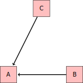

Graphics for Chapter 17
========================================================

Some of the graphics are produced in latex.

You have to put the following commands (in the double dollar signs) at the start of the
document.
$$
\newcommand{\causes}{{\Rightarrow}}
\newcommand{\causedBy}{{\Leftarrow}}
\newcommand{\correlatedWith}{{\Leftrightarrow}}$$

$A\causes C\causes B$

$A\causedBy C\causedBy B$

$A\causedBy C\causes B$

$A\causedBy C\causes D \causedBy E\causedBy B$

## Problem 17.05  

paths-104

## Problem 17.06

paths-105

## Problem 17.07

paths-106

## Problem 17.08

paths-107

## Problem 17.10

paths-103

## Problem 17.11

paths-108

## Problem 17.12

paths-109
