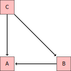

Intro to Statistical Modeling Ch. 17 Prob. 5
========================================================
```{r include=FALSE}
require(mosaic)
require(WriteScoreR)
newScorerSet("SM-17-5-SD")
```

Consider this hypothetical causal network: 



* Suppose you want to study the effect of B on A.  Which of the models is most appropriate?
```{r include=FALSE}
f=newMC(totalPts=1)
```
`r I(f(FALSE))` *A* ~ *B*    
`r I(f(FALSE))` *A* ~ *C*    
`r I(f(TRUE))` *A* ~ *B* + *C*    
`r I(f(FALSE))` Any of the above.
```{r include=FALSE, results='hide'}
I(f(finish=TRUE))
```

* Suppose you want to study the overall effect of C on A.  Which of the models is most appropriate?
```{r include=FALSE}
g=newMC(totalPts=1)
```
`r I(g(FALSE))` *A* ~ *B*    
`r I(g(TRUE))` *A* ~ *C*    
`r I(g(FALSE))` *A* ~ *B* + *C*    
`r I(g(FALSE))` Any of the above.
```{r include=FALSE, results='hide'}
I(g(finish=TRUE))
```

* Suppose you want to study the direct effect of C on A, neglecting the indirect effect through B.  Which of the models is most appropriate?
```{r include=FALSE}
h=newMC(totalPts=1)
```
`r I(h(FALSE))` *A* ~ *B*    
`r I(h(FALSE))` *A* ~ *C*    
`r I(h(TRUE))` *A* ~ *B* + *C*    
`r I(h(FALSE))` Any of the above.
```{r include=FALSE, results="hide"}
I(h(finish=TRUE))
```

`r I(closeProblem())`