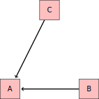

Intro to Statistical Modeling Ch. 17 Prob. 6
========================================================
```{r include=FALSE}
require(mosaic)
require(ScoreR)
startProblem("SM-17-6-SD")
```

Consider this hypothetical causal network: 



* Suppose you want to study the effect of B on A.  Which of the models is appropriate?
```{r include=FALSE}
f=newMC(totalPts=1, name="model")
```
`r I(f(FALSE))` *A* ~ *B*     
`r I(f(FALSE))` *A* ~ *B* + *C*    
`r I(f(FALSE))` Neither (A) nor (B).    
`r I(f(TRUE))` Either (A) or (B).
`r I(f(finish=TRUE))`

* Suppose you want to study the overall effect of C on A.  Which of the models is appropriate?
```{r include=FALSE}
g=newMC(totalPts=1, name="model2")
```
`r I(g(FALSE))` *A* ~ *C*    
`r I(g(FALSE))` *A* ~ *B* + *C*   
`r I(g(FALSE))` Neither (A) nor (B).    
`r I(g(TRUE))` Either (A) or (B).
`r I(g(finish=TRUE))`

`r I(endProblem())`