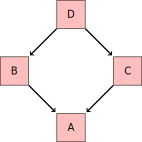

Intro to Statistical Modeling Ch. 17 Prob. 7
========================================================
```{r include=FALSE}
require(mosaic)
require(ScoreR)
startProblem("SM-17-7-SD")
```

Consider this hypothetical causal network: 




* Suppose you want to study the overall effect of D on A.  Which of the models is most appropriate?
```{r include=FALSE}
f=newMC(totalPts=1, name="model1")
```
`r I(f(TRUE))` *A* ~ *D*    
`r I(f(FALSE))` *A* ~ *D* + *C*    
`r I(f(FALSE))` *A* ~ *B* + *C*    
`r I(f(FALSE))` *A* ~ *D* + *B* + *C*    
`r I(f(FALSE))` Any of the above.    
`r I(f(finish=TRUE))`

* Suppose you want to study the effect of B on A.  Which of the models is most appropriate?
```{r include=FALSE}
g=newMC(totalPts=1, name="model2")
```
`r I(g(FALSE))` *A* ~ *B* + *D*    
`r I(g(FALSE))` *A* ~ *B* + *C*     
`r I(g(FALSE))` *A* ~ *B* + *C* +*D*    
`r I(g(TRUE))` Any of the above.    
`r I(g(finish=TRUE))`

* Suppose you want to study the overall effect of C on A.  Which of the models is most appropriate?
```{r include=FALSE}
h=newMC(totalPts=1, name="model3")
```
`r I(h(FALSE))` *A* ~ *C* + *D*    
`r I(h(FALSE))` *A* ~ *B* + *C*   
`r I(h(FALSE))` *A* ~ *B* + *C* + *D*    
`r I(h(TRUE))` Any of the above.    
`r I(h(finish=TRUE))`

`r I(endProblem())`