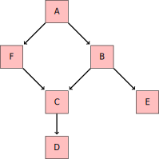

Intro to Statistical Modeling Ch. 17 Prob. 11
========================================================
```{r include=FALSE}
require(mosaic)
require(ScoreR)
startProblem("SM-17-11-SD")
```
Here is a somewhat complicated hypothetical causal network:



You are interested in studying the causal effect of F on D.  

You want to block the backdoor pathway from F to D through A.  For each of the following covariates, say what will be the effect of including the covariate in your model on the pathway.
```{r include=FALSE}
prob1=selectSet(name="A", totalPts=1, "Blocks"=TRUE, "Unblocks"=FALSE, "Neither"=FALSE)
```
*  A:  `r I(prob1)`
```{r include=FALSE}
prob2=selectSet(name="B", totalPts=1, "Blocks"=TRUE, "Unblocks"=FALSE, "Neither"=FALSE)
```
*  B:  `r I(prob2)`
```{r include=FALSE}
prob3=selectSet(name="E", totalPts=1, "Blocks"=FALSE, "Unblocks"=FALSE, "Neither"=TRUE)
```
*  E:  `r I(prob3)`


You could use C to block the backdoor pathway from F to D through A. Explain why this would not be a good thing to do if you want to study the causal connection between F and D.

`r I(textItem(name="explain", totalPts=2, rows=3))`

<aside>
ANSWER:    
While C blocks the backdoor pathway, as a causal mediator between F and D it also blocks the pathway that you want to study.
</aside>

`r I(endProblem())`